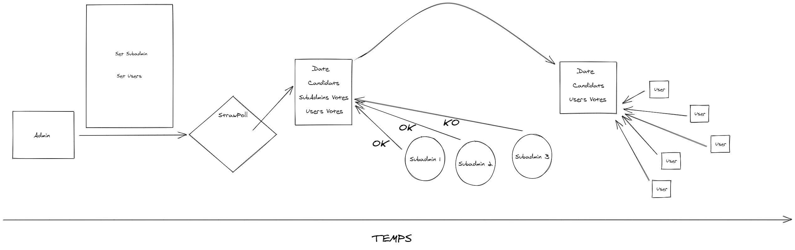
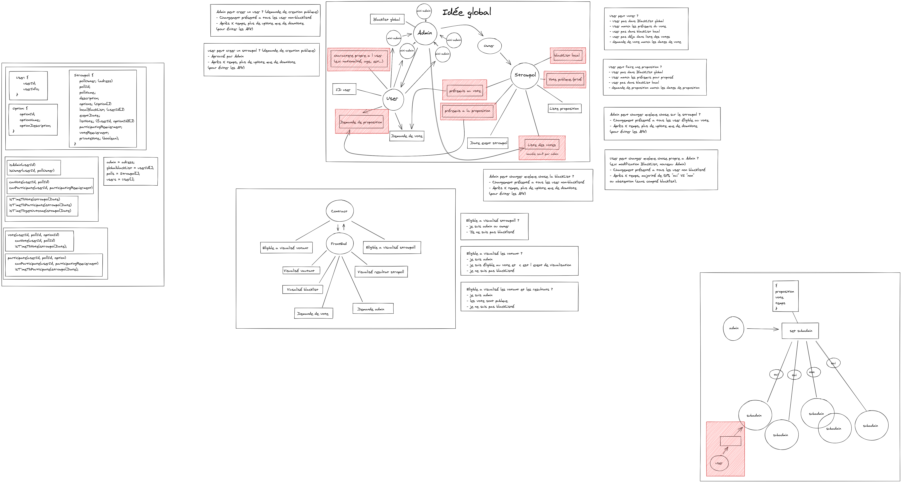

# SmartVote

A voting software, decentralized and secured running on the blockchain.

## Introduction

The idea of SmartVote is to make it possible to follow and participate to an election without having to be vigilant
about the eligibility of the organizer. Indeed, running an election trough a blockchain allow us to make the poll system
100% secure ! No one will be able to make "fake votes" or to fake the output of an election !

We are using Etherium as our blockchain; Etherium let us interact with it very easily, making it possible for us to focus on our UI interaction rather than loosing time on less important things. One of the great things about Etherium is that everything is transparent, making it possible for a user to have a total trust in SmartVote; users will always be able to see what does what, whithout having to worry about possible scams !

Futhermore, by letting our project as "opensource", we make it possible for other people to recreate our voting system as they want, and they will be able to easily fix possible mistakes without having theme reverse engineering our system!

## SmartVote Draft

Here you can see what we had in minds when creating our architecture.

First, a representation of how SmartVote would work:

Then, a representation of what our architecture would look like:

## The architecture

As said earlier, our poll system tries to be the most secure possible, this is why we have different actors interacting
with us within the life of a poll.

### The Owner

Also known as the "Administrator", he is the person with the highest rank; for example only him can destroy our project
within the blockchain !

Within all his mighty power, he can do a lot of things:

- He is the one that will be able to register you as someone "eligible" to vote to a poll
- He has also the power to take back your eligibility
- He will be the one that will create polls (when ? for who ?, etc...)

But within all this power, he has restrictions ! Indeed, he cannot create any number of random polls, he will need to
pass through the **Subadministrator**.

### The Subadministrator

The Subadministrator is a group of **12** users that will decide if one of the requests of the Administrator is accepted or
not.

Whenever the Administrator wants to submit a poll, the subadministartors have a certain time to vote in favor or not to the poll; in a case of an acceptance from them, the poll will be given to the users, otherwise, the poll will be thrown away.

### The User

The user is the main part of the SmartVote; it is them that will receive polls and they will choose the option that they prefer
the most ! Without the users, the administrator and the subadministrators are powerless; in fact, the administrator and the subadministrators are there to guide the users and avoid the rising of unwanted features; they are there to keep everyone
safe from possible "coup d'état".

## Where are we ?

Here's SmartVote time line:

- **Sprint 1**: Research phase about the used technologies.
- **Sprint 2**: Building the basic structure of our different contracts.
- **Sprint 3**: Building our first interactions between our type of users (Administrators to Subadministrators).
- **Sprint 4**: Reviewing our work so far.
- **Sprint 5**: Implementing tests on our contract and try it out locally.

## The future of SmartVote

Our goal is that the more we go forward within this project, the more the Subadministrators and the Users have power. For
the moment we focus on a simple voting system following the above architecture; we still have to implement a prettier interface for the user thanks to "D3.js". Once all the basics will be there, we will be able to focus on an architecture
making the users the primary decision maker with the Subadministrators.

#### Credit

Project followed by Quentin Fringhian, and managed by Tom Chauveau and Luca Georges Francois.
